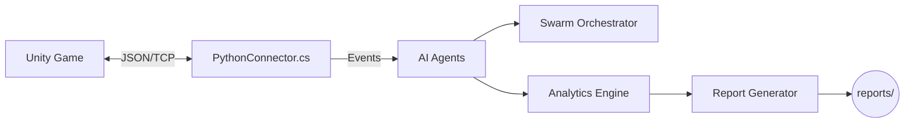

<div align="center">

<h1>Unity‑Agent</h1>

<p><b>AI‑Driven Playtesting for Unity</b> — simulate players, find bugs, balance difficulty, and auto‑generate actionable reports.</p>

<p>
  
  
  
  
  
</p>

</div>

---

- Blazing‑fast swarm testing with 50+ agents 🐜
- Automatic anomaly and soft‑lock detection 🧭
- Heatmaps, difficulty spikes, and engagement analytics 📊
- Zero‑config reports: JSON, human‑readable, and LLM‑ready 🧠

## Quickstart

```bash
# clone
git clone https://github.com/somdipto/unity-agent.git
cd unity-agent

# install
pip install -r requirements.txt

# run single‑player test (5 agents for 5 minutes)
python -m src --game-path /path/to/game.exe --agents 5 --duration 300

# run swarm test (multiplayer)
python -m src --game-path /path/to/game.exe --agents 50 --multiplayer --duration 900
```

## Features

- 🤖 AI Agents: naturalistic behavior modeling and exploration
- 🐜 Swarm Orchestrator: scalable, concurrent agent control for stress tests
- 🧠 Analytics Engine: engagement, difficulty, pathing, and anomaly insights
- 🔥 Heatmaps: visualize hotspots and player flows
- 📑 Reporting: structured JSON + readable TXT + LLM summaries
- 🔌 Unity Plugin: lightweight C# connector over JSON/TCP

## Architecture



Directory overview:

```
unity-agent/
├─ src/
│  ├─ agents/               # Agent logic
│  ├─ analytics/            # Metrics & analysis
│  ├─ reporting/            # Reports (JSON, TXT, LLM)
│  ├─ swarm/                # Multiplayer orchestration
│  ├─ unity_integration/    # Unity bridge & interfaces
│  └─ utils/                # Helpers
├─ unity_plugin/            # C# scripts for Unity
├─ examples/                # Example usage
├─ docs/                    # Extra docs
└─ reports/                 # Generated outputs
```

## Command Line Options

```
--game-path PATH       Path to the Unity game executable
--agents NUM           Number of AI agents to simulate (default: 1)
--multiplayer          Enable multiplayer swarm mode
--duration SECONDS     Test duration (default: 300)
--output PATH          Output directory for reports (default: ./reports)
```

## Unity Integration (3 steps)

1) Drop the C# scripts from `unity_plugin/Assets/Scripts/` into your project.
2) Attach `PythonConnector.cs` to a scene object (e.g., GameManager) and set host/port.
3) Ensure gameplay components (PlayerHealth, CombatManager, ObjectiveTracker, PlayerController) are available.

## Examples

Minimal Python usage:

```python
from src.agents.agent_manager import AgentManager
from src.analytics.analytics_engine import AnalyticsEngine
from src.reporting.report_generator import ReportGenerator

analytics = AnalyticsEngine()
manager = AgentManager(
    game_path="/path/to/game.exe",
    num_agents=10,
    duration=300,
    analytics_engine=analytics,
)
results = manager.run_playtesting()
ReportGenerator(output_dir="./reports").generate_comprehensive_report(results)
```

## Reports

Outputs are timestamped under `./reports/`:
- structured_report.json — complete metrics for tooling
- human_readable_report.txt — concise human summary
- llm_summary.json — compact LLM‑friendly view

## Development

Run quick component tests:

```bash
python -c "import sys; sys.path.append('./src'); from tests.unit_tests import test_game_state, test_base_agent, test_analytics_engine; test_game_state(); test_base_agent(); test_analytics_engine(); print('All component tests passed!')"
```

## Contributing

- Fork → feature branch → PR
- Add tests and update docs for new functionality

## License

TBD

---

Made with ❤️ for better games.
