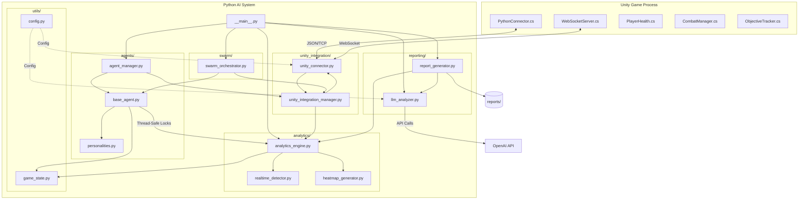

<div align="center">

<h1>Unity‑Agent</h1>

<p><b>AI‑Driven Playtesting for Unity</b> — simulate players, find bugs, balance difficulty, and auto‑generate actionable reports with LLM-powered insights.</p>

<p>
  
  
  
  
  
</p>

</div>

---

- **Blazing‑fast Swarm Testing:** Orchestrate 50+ concurrent agents 🐜
- **Real-time Analytics:** Automatic anomaly, soft‑lock, and difficulty spike detection 🧭
- **Visual Insights:** Heatmaps, engagement metrics, and player flow analysis 📊
- **AI Game Critic:** LLM-powered "Fun Factor" assessment and narrative reviews 🧠
- **Robust Architecture:** Thread-safe analytics and optimized networking 🛡️

## Quickstart

```bash
# clone
git clone https://github.com/somdipto/unity-agent.git
cd unity-agent

# install dependencies
pip install -r requirements.txt

# run single‑player test (5 agents for 5 minutes)
python -m src.__main__ --game-path /path/to/game.exe --agents 5 --duration 300

# run with AI Critic enabled (requires OpenAI API Key)
python -m src.__main__ --game-path /path/to/game.exe --agents 10 --duration 300 --api-key sk-your-key-here
```

## Features

- 🤖 **AI Agents:** Naturalistic behavior modeling with distinct personalities (Cautious, Aggressive, Speedrunner, etc.).
- 🐜 **Swarm Orchestrator:** Scalable, multi-threaded control for multiplayer stress testing.
- 🧠 **Analytics Engine:** Thread-safe collection of engagement, difficulty, and pathing metrics.
- 📝 **AI Game Critic:** Uses OpenAI to generate qualitative feedback:
    - **Fun Assessment:** Scores the game's engagement level (1-10).
    - **Actionable Suggestions:** Proposes specific design fixes.
    - **Narrative Reports:** Writes a "review" of the session from the agent's perspective.
- 🔌 **Unity Plugin:** Optimized C# connector using efficient JSON/TCP communication.

## Architecture

The system uses a synchronous, multi-threaded architecture to manage agents, while utilizing a thread-safe Analytics Engine for data aggregation.



## Command Line Options

```
--game-path PATH       Path to the Unity game executable (Required)
--agents NUM           Number of AI agents to simulate (default: 1)
--multiplayer          Enable multiplayer swarm mode
--duration SECONDS     Test duration in seconds (default: 300)
--output PATH          Output directory for reports (default: ./reports)
--api-key KEY          OpenAI API Key for qualitative analysis (Optional)
```

## Unity Integration

1.  **Install Scripts:** Drop the C# scripts from `unity_plugin/Assets/Scripts/` into your Unity project.
2.  **Setup Connector:** Attach `PythonConnector.cs` to a persistent scene object (e.g., GameManager).
3.  **Configure Game:** Ensure standard components (`PlayerHealth`, `CombatManager`, etc.) are accessible to the connector.

## Reports

Reports are generated in timestamped folders under `./reports/`:

*   `human_readable_report.txt`: A concise summary for developers.
*   `structured_report.json`: Raw metrics for external tools.
*   `llm_insights.json`: (Optional) Qualitative analysis including Fun Score and Suggestions.

## Development

Run component tests:

```bash
export PYTHONPATH=$PYTHONPATH:.
python -c "from src.tests.unit_tests import test_game_state, test_base_agent, test_analytics_engine; test_game_state(); test_base_agent(); test_analytics_engine(); print('All component tests passed!')"
```

## Contributing

1.  Fork the repository.
2.  Create a feature branch.
3.  Submit a Pull Request.